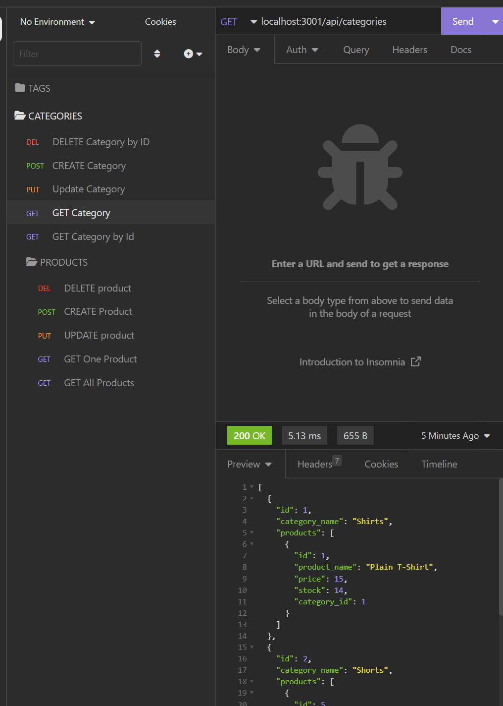

# E-Commerce
Internet Retail Site

## <section id = "License">License</section>
N/A

## <section id = "Description">Description</section>
This project was made using node.js, express, and sequelize. Once the necessary modules have been installed, a user can copy the schema into MySql Workbench and seed the database. The user should then be able to connect to the server and receive/update information in the database using the get/post/put/delete routes.

Link to video demonstration: https://drive.google.com/file/d/1ThQtPd_WrH1pFoZyZH7lIM4U6s6rtuXa/view

## Table of Contents
1.) <a href = "#License">License</a> 
2.) <a href = "#Description">Description</a> 
3.) <a href = "#Installation">Installation</a>  
4.) <a href = "#Usage">Usage</a> 
5.) <a href = "#Contributing">Contributing</a> 
6.) <a href = "#Tests">Tests</a> 
7.) <a href = "#Questions">Questions</a>

## <section id = "Installation">Installation</section>
Command to Install Dependencies: npm i

## <section id = "Usage">Usage</section>
Using the Repo: Add ecommerce_db schema to MySql workbench. Then type into the terminal npm run seed. Lastly run node server.js to connect to the server. 

## <section id = "Contributing">Contributing</section>
Contributing to the Repo: Currently not taking contributions.

## <section id = "Tests">Tests</section>
N/A

## <section id = "Questions">Questions</section>
If you have any questions, please feel free to contact me:   
1.) Github Username: Cgotts1  
2.) Email Address: cobi.gottschalk@gmail.com